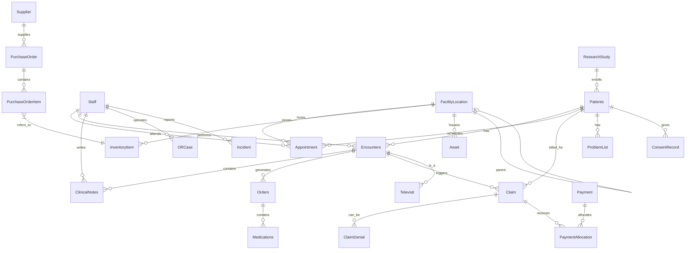

# Hospital ERP ER Diagram

## Entity Groupings

### Clinical
- `Patients`: Master identity record.
- `Encounters`: Single point of care interaction.
- `ClinicalNotes`: Documentation of care.
- `ProblemList`: Chronic/acute conditions.
- `Orders`: Clinical requests (Labs, Meds, Imaging).

### Admin & Staff
- `Staff`: Employees with credentials and roles.
- `FacilityLocation`: Wards, rooms, clinics, and sites.
- `Appointment`: Time-slotted resource booking.

### Billing
- `Payer`: Insurance companies or self-pay entities.
- `Claim`: Bill sent to payer.
- `Payment`: Financial transaction received.

### Logistics
- `InventoryItem`: Consumables and medications in stock.
- `PurchaseOrder`: Procurement of goods.
- `Asset`: Medical equipment tracking.
